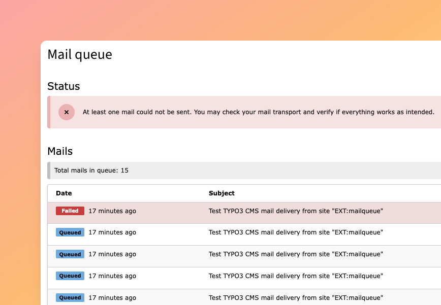
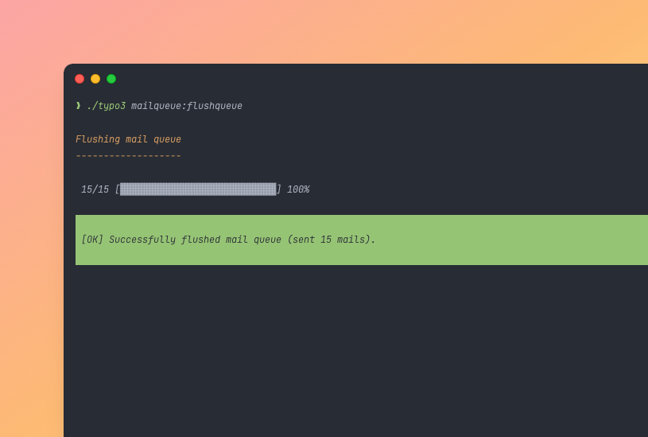
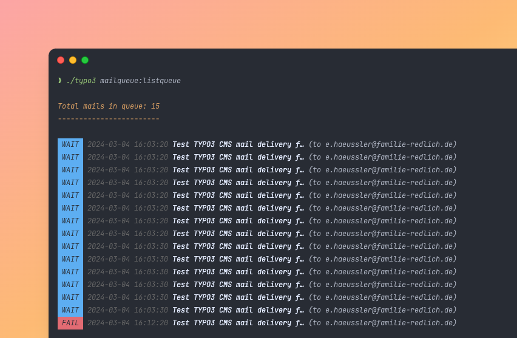

<div align="center">


# TYPO3 extension `mailqueue`

[](https://codecov.io/gh/CPS-IT/mailqueue)
[](https://codeclimate.com/github/CPS-IT/mailqueue/maintainability)
[](https://github.com/CPS-IT/mailqueue/actions/workflows/cgl.yaml)
[](https://github.com/CPS-IT/mailqueue/actions/workflows/release.yaml)
[](LICENSE.md)\
[](https://extensions.typo3.org/extension/mailqueue)
[](https://extensions.typo3.org/extension/mailqueue)
[](https://extensions.typo3.org/extension/mailqueue)
[](https://extensions.typo3.org/extension/mailqueue)

📦&nbsp;[Packagist](https://packagist.org/packages/cpsit/typo3-mailqueue) |
🐥&nbsp;[TYPO3 extension repository](https://extensions.typo3.org/extension/mailqueue) |
💾&nbsp;[Repository](https://github.com/CPS-IT/mailqueue) |
🐛&nbsp;[Issue tracker](https://github.com/CPS-IT/mailqueue/issues)

</div>

---

An extension for TYPO3 CMS that extends TYPO3's mail spooling functionality
with an extended queueable mail transport interface. In addition, it provides
an improved version of TYPO3's `FileSpooler`. In order to make mails in the
mail queue visible, the extension provides an (admin-only) backend module and
console commands to list and flush the mail queue.

## 🚀 Features

* Extended interface for queueable mail transports
* Improved queueable file transport with failure metadata
* Backend module to list mails in queue
* Console command to list queue and flush mails
* Compatible with TYPO3 11.5 LTS and 12.4 LTS

## 🔥 Installation

### Composer

```bash
composer require cpsit/typo3-mailqueue
```

### TER

Alternatively, you can download the extension via the
[TYPO3 extension repository (TER)][1].

## ⚡ Usage

> [!NOTE]
> In order to use a queueable mail transport, you need to [configure](#mail-settings)
> it in your system settings, along with the required transport settings.

### Concept

The extension builds on TYPO3's [mail spooling][2] feature. It provides an extended
interface [`CPSIT\Typo3Mailqueue\Mail\Transport\QueueableTransport`](Classes/Mail/Transport/QueueableTransport.php)
for `TYPO3\CMS\Core\Mail\DelayedTransportInterface` with additional
methods to enqueue and dequeue mails:

* ```php
  public function getMailQueue(): Mail\Queue\MailQueue
  ```
  Returns an instance of [`CPSIT\Typo3Mailqueue\Mail\Queue\MailQueue`](Classes/Mail/Queue/MailQueue.php)
  that holds all currently enqueued mails as instances of
  [`CPSIT\Typo3Mailqueue\Mail\Queue\MailQueueItem`](Classes/Mail/Queue/MailQueueItem.php).

* ```php
  public function enqueue(Mime\RawMessage $message, ?Mailer\Envelope $envelope = null): Mail\Queue\MailQueueItem
  ```
  Allows to enqueue a mail to the mail queue. This is basically identical to the `send()`
  method provided by the base `Symfony\Component\Mailer\Transport\TransportInterface`.

* ```php
  public function dequeue(Mail\Queue\MailQueueItem $item, Mailer\Transport\TransportInterface $transport): bool
  ```
  Sends the message of a given mail queue item with the provided "real" transport,
  effectively dequeuing it from the mail queue. This is basically identical to the
  `flushQueue()` method provided by the base `TYPO3\CMS\Core\Mail\DelayedTransportInterface`
  with the difference that it only dequeues the given mail queue item and leaves the
  rest of the queue untouched.

* ```php
  public function delete(Mail\Queue\MailQueueItem $item): bool
  ```
  Deletes the message of a given mail queue item without sending it. The message is
  also dequeued from the mail queue.

#### Recoverable transports

Next to the `QueueableTransport` interface there exists an extended interface
[`CPSIT\Typo3Mailqueue\Mail\Transport\RecoverableTransport`](Classes/Mail/Transport/RecoverableTransport.php).
It allows to recover stuck mails with a configured recover timeout:

* ```php
  public function recover(int $timeout = 900): void
  ```
  Recovers mails that are enqueued for longer than the given timeout (in seconds) and
  are in "sending" state. Recovering a mail resets their mail state from "sending" to
  "queued". They will then be sent again on dequeue or when the mail queue is flushed.

### Backend module

> [!NOTE]
> Only administrators can see the backend module.



The backend module lists all currently enqueued mails. In addition, for
supported transports it may also show transport failure details. It can
be used to get a quick overview about the health state of the mail queue.
It also allows to dequeue single mails from the mail queue by sending them
with the configured real transport.

### Console commands

#### Flush queue



The extension provides a console command to flush the mail queue:

```bash
typo3 mailqueue:flushqueue [-l|--limit] [-r|--recover-timeout] [-j|--json]
```

The number of mails to be sent can be limited with `--limit` (or `-l`). If
no limit is passed, the whole mail queue is flushed.

For transports implementing the `RecoverableTransport` interface, the recover
timeout can be configured with `--recover-timeout` (or `-r`).

When using `--json` (or `-j`), user-oriented output is written to stderr and
result messages are written in JSON format to stdout.

#### List queue



The extension provides a console command to list enqueued mails:

```bash
typo3 mailqueue:listqueue [-s|--strict] [-w|--watch]
```

With `--strict` (or `-s`) enabled, the command exits with a non-zero exit
code in case any enqueued mail could not be delivered because of a failure.

In addition, a watch mode can be enabled with `--watch` (or `-w`) which updates
the list every five seconds. The watch mode can be exited with <kbd>Ctrl+C</kbd>.

### Available transports

The extension provides two custom implementations as XClasses for TYPO3's
native mail spoolers:

| TYPO3 core implementation         | Custom implementation (XClass)                                                                                        |
|-----------------------------------|-----------------------------------------------------------------------------------------------------------------------|
| `TYPO3\CMS\Core\Mail\FileSpool`   | [`CPSIT\Typo3Mailqueue\Mail\Transport\QueueableFileTransport`](Classes/Mail/Transport/QueueableFileTransport.php)     |
| `TYPO3\CMS\Core\Mail\MemorySpool` | [`CPSIT\Typo3Mailqueue\Mail\Transport\QueueableMemoryTransport`](Classes/Mail/Transport/QueueableMemoryTransport.php) |

## 📂 Configuration

### Mail settings

Queueable mail transports are registered the "normal" way as described in the
[official TYPO3 core documentation][3]. Add the following to your system configuration
(e.g. in `additional.php`/`AdditionalConfiguration.php`):

```php
# File transport
$GLOBALS['TYPO3_CONF_VARS']['MAIL']['transport_spool_type'] = 'file';
$GLOBALS['TYPO3_CONF_VARS']['MAIL']['transport_spool_filepath'] = '/path/to/mailqueue';

# Memory transport
$GLOBALS['TYPO3_CONF_VARS']['MAIL']['transport_spool_type'] = 'memory';

# Use any other custom mail transport
# Note: Custom transports must implement CPSIT\Typo3Mailqueue\Mail\Transport\QueueableTransport interface!
$GLOBALS['TYPO3_CONF_VARS']['MAIL']['transport_spool_type'] = \Vendor\Extension\Mail\Transport\CustomQueueableTransport::class;
```

### Extension configuration

The following extension configuration options are available:

| Configuration key             | Description                                                               | Required | Default |
|-------------------------------|---------------------------------------------------------------------------|----------|---------|
| **`queue.delayThreshold`**    | Number in seconds after which a mail in the queue is considered "delayed" | –        | `1800`  |
| **`pagination.itemsPerPage`** | Number of mails to display on a single page in backend module             | –        | `20`    |

## 🧑‍💻 Contributing

Please have a look at [`CONTRIBUTING.md`](CONTRIBUTING.md).

## 💎 Credits

The extension icon ("envelope-open") as well as the icon for the backend module are
modified versions of the original [`actions-envelope-open`][4] icon from TYPO3 core
which is originally licensed under [MIT License][5].

## ⭐ License

This project is licensed under [GNU General Public License 2.0 (or later)](LICENSE.md).

[1]: https://extensions.typo3.org/extension/mailqueue
[2]: https://docs.typo3.org/m/typo3/reference-coreapi/main/en-us/ApiOverview/Mail/Index.html#spooling
[3]: https://docs.typo3.org/m/typo3/reference-coreapi/main/en-us/Configuration/Typo3ConfVars/MAIL.html#transport-spool-type
[4]: https://typo3.github.io/TYPO3.Icons/icons/actions/actions-envelope-open.html
[5]: https://github.com/TYPO3/TYPO3.Icons/blob/main/LICENSE
